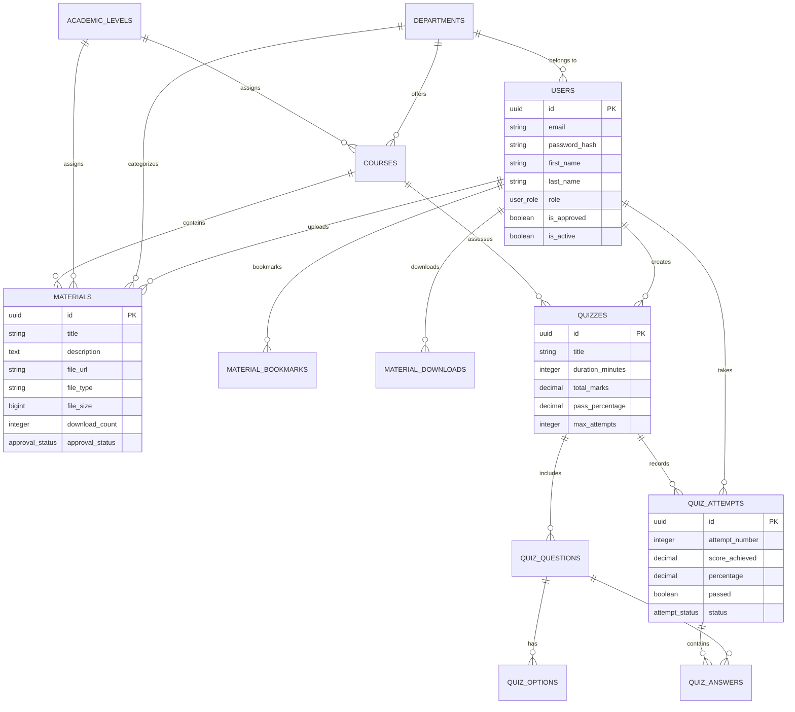

# Entity-Relationship Diagram (ERD) & Data Dictionary
## Faculty of Science Academic Repository and Assessment Portal (FSARAP)

---

## 1. Entity-Relationship Diagram (Mermaid Format)

---

## 2. PostgreSQL Data Dictionary

### Table: `users`
| Column Name | Data Type | Constraints | Description |
| :--- | :--- | :--- | :--- |
| `id` | `UUID` | `PRIMARY KEY, DEFAULT gen_random_uuid()` | Unique user identifier |
| `email` | `VARCHAR(255)` | `UNIQUE, NOT NULL` | Academic email address |
| `password_hash` | `VARCHAR(255)` | `NOT NULL` | Bcrypt hashed password |
| `first_name` | `VARCHAR(100)` | `NOT NULL` | First name |
| `last_name` | `VARCHAR(100)` | `NOT NULL` | Surname / Last name |
| `role` | `USER_ROLE` | `NOT NULL, DEFAULT 'student'` | Role enum: `student`, `lecturer`, `faculty_admin`, `super_admin` |
| `department_id` | `UUID` | `REFERENCES departments(id)` | User's department |
| `level_id` | `UUID` | `REFERENCES academic_levels(id)` | Student's academic level (100L-500L) |
| `staff_id` | `VARCHAR(50)` | `NULL` | Lecturer staff ID |
| `matric_number`| `VARCHAR(50)` | `NULL` | Student matriculation number |
| `is_approved` | `BOOLEAN` | `DEFAULT TRUE` | Lecturer verification flag (FALSE for new lecturers) |
| `is_active` | `BOOLEAN` | `DEFAULT TRUE` | Account activation flag |

### Table: `materials`
| Column Name | Data Type | Constraints | Description |
| :--- | :--- | :--- | :--- |
| `id` | `UUID` | `PRIMARY KEY, DEFAULT gen_random_uuid()` | Unique material identifier |
| `title` | `VARCHAR(255)` | `NOT NULL` | Title of lecture material |
| `description` | `TEXT` | `NULL` | Material summary & learning objectives |
| `course_id` | `UUID` | `REFERENCES courses(id)` | Associated course |
| `department_id` | `UUID` | `REFERENCES departments(id)` | Department classification |
| `level_id` | `UUID` | `REFERENCES academic_levels(id)` | Academic level classification |
| `semester_id` | `UUID` | `REFERENCES semesters(id)` | Semester classification |
| `session_id` | `UUID` | `REFERENCES academic_sessions(id)`| Session classification |
| `uploader_id` | `UUID` | `REFERENCES users(id)` | Uploader user ID |
| `category` | `VARCHAR(100)` | `NOT NULL` | Notes, Manual, Lab Guide, Past Questions |
| `file_url` | `TEXT` | `NOT NULL` | Supabase Storage public URL |
| `file_path` | `TEXT` | `NOT NULL` | Storage bucket object path |
| `file_type` | `VARCHAR(20)` | `NOT NULL` | Extension: pdf, docx, pptx, zip |
| `file_size` | `BIGINT` | `NOT NULL` | File size in bytes |
| `download_count` | `INTEGER` | `DEFAULT 0` | Real-time download counter |
| `approval_status`| `APPROVAL_STATUS`| `DEFAULT 'approved'` | Enum: `pending`, `approved`, `rejected` |

### Table: `quizzes`
| Column Name | Data Type | Constraints | Description |
| :--- | :--- | :--- | :--- |
| `id` | `UUID` | `PRIMARY KEY` | Unique quiz identifier |
| `title` | `VARCHAR(255)` | `NOT NULL` | Quiz title |
| `course_id` | `UUID` | `REFERENCES courses(id)` | Course assessed |
| `creator_id` | `UUID` | `REFERENCES users(id)` | Lecturer who created quiz |
| `duration_minutes`| `INTEGER` | `DEFAULT 30` | Countdown timer duration |
| `pass_percentage`| `DECIMAL(5,2)` | `DEFAULT 50.00` | Minimum score required to pass |
| `max_attempts` | `INTEGER` | `DEFAULT 3` | Maximum allowed attempts per student |
